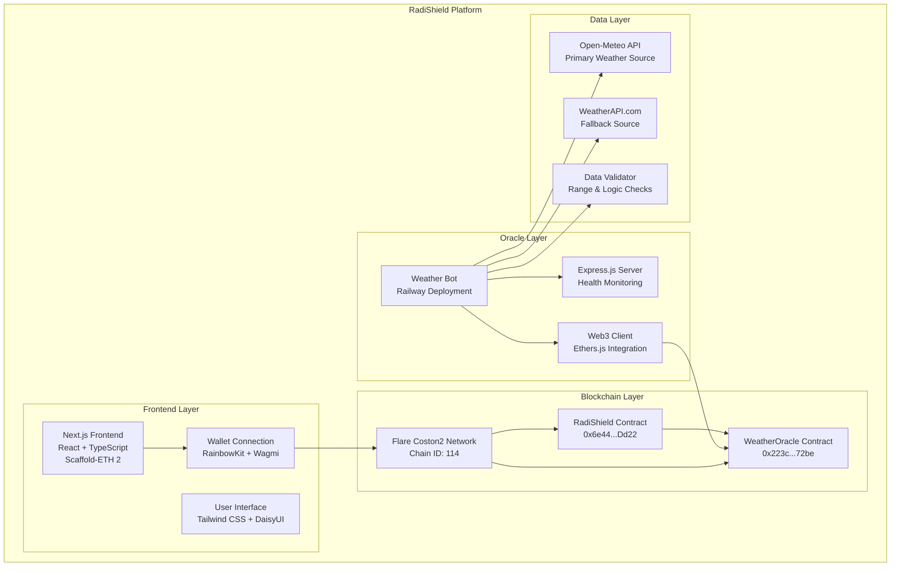
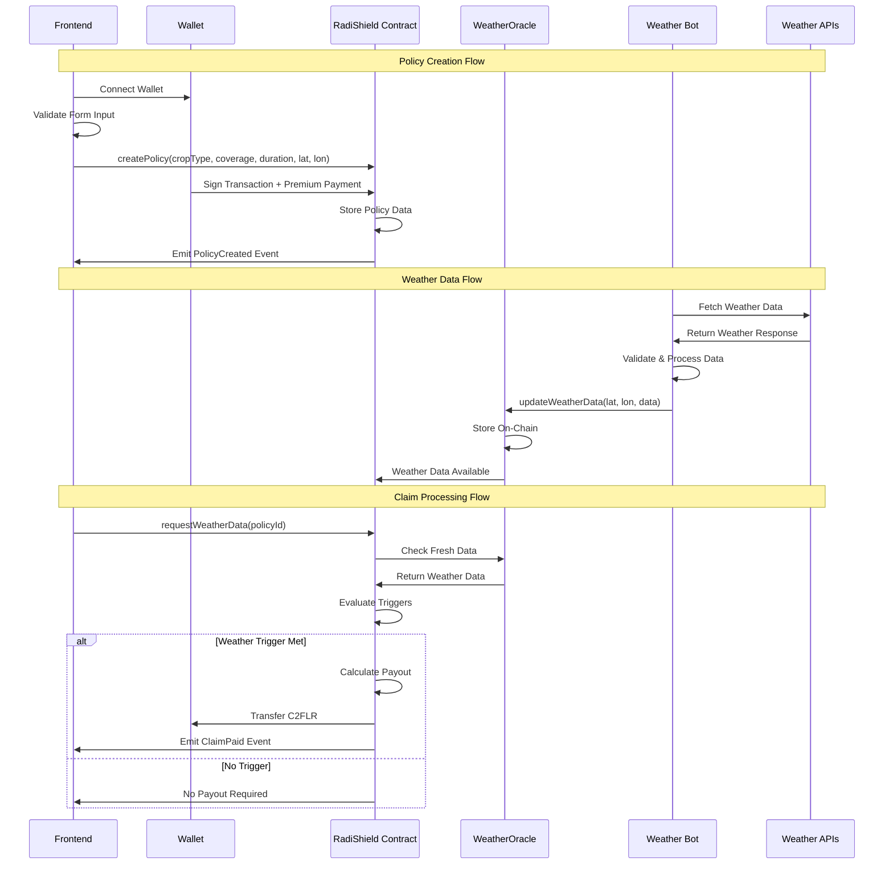
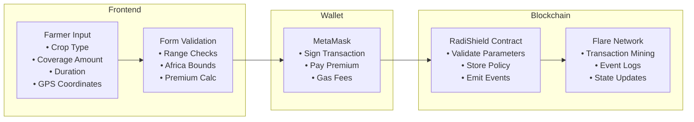
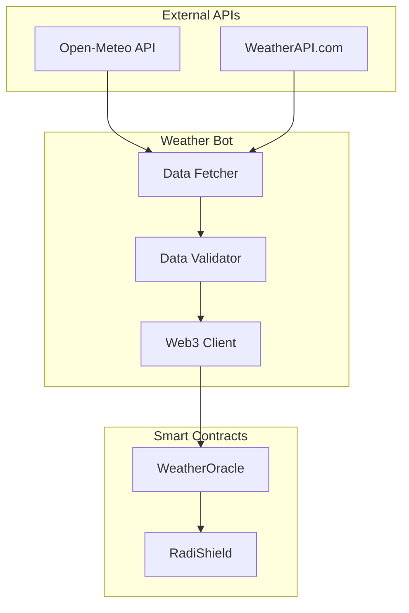
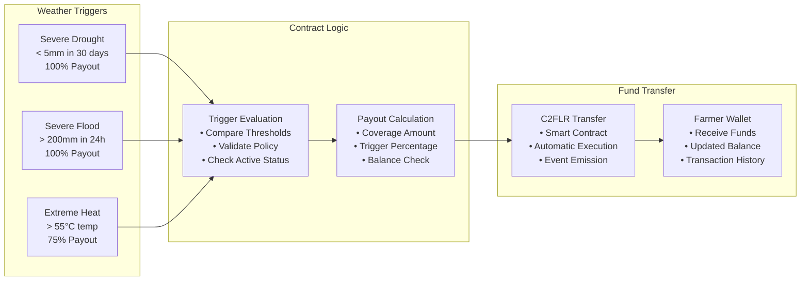

# RadiShield - Parametric Crop Insurance Platform

RadiShield is a blockchain-based parametric crop insurance platform that provides automated weather-triggered payouts for African farmers. Built on the Flare network, it combines smart contracts, real-time weather data, and a user-friendly interface to deliver transparent, efficient, and trustless insurance coverage.

## Mission

Protecting African farmers from climate risks through innovative blockchain technology and automated weather-based insurance payouts.

## System Architecture

### High-Level Architecture



### Component Interaction Flow



### Data Flow Architecture

#### 1. Policy Creation Flow



#### 2. Weather Data Flow



#### 3. Claim Processing Flow



## Key Features

### For Farmers

- Easy policy creation with GPS-based coverage
- Support for major African crops (maize, coffee, tea, rice, wheat)
- Flexible coverage: 1-10 C2FLR with 30-365 day duration
- Automatic payouts without paperwork

### Weather Protection

- **Severe Drought**: <5mm rainfall in 30 days → 100% payout
- **Severe Flood**: >200mm rainfall in 24 hours → 100% payout
- **Extreme Heatwave**: >55°C temperature → 75% payout

### Technical Features

- Parametric insurance with objective weather triggers
- Blockchain transparency on Flare network
- Real-time weather data integration
- Multi-source data validation

## Network Information

### Flare Coston2 Testnet

- **Chain ID**: 114
- **Native Token**: C2FLR (Coston2 Flare)
- **RPC URL**: https://coston2-api.flare.network/ext/C/rpc
- **Explorer**: https://coston2.testnet.flarescan.com

### Deployed Contracts

- **RadiShield**: `0x6e4410795200366439B9c1f567f1AE43D777Dd22`
- **WeatherOracle**: `0x223cb9DFE5d4427cF50d1f33C3a3BaAc3DbE72be`

### Weather Bot Service

- **URL**: https://radishield-production.up.railway.app
- **Health Check**: `/health`
- **Status**: `/status`

## Quick Start

### Prerequisites

- Node.js >=20.18.3
- Yarn v3.2.3
- MetaMask or compatible Web3 wallet
- C2FLR testnet tokens

### Installation

```bash
# Clone the repository
git clone https://github.com/Shreyassp002/radishield
cd RadiShield
```

For detailed setup instructions, check the component-specific documentation:

- [Smart Contracts Setup](./contract/README.md)
- [Frontend Setup](./frontend/README.md)
- [Weather Bot Setup](./weather_bot/README.md)

### Getting Testnet Tokens

1. Add Flare Coston2 testnet to your wallet
2. Get C2FLR from the Flare testnet faucet
3. Connect your wallet to the application
4. Start creating insurance policies

## Project Structure

```
RadiShield/
├── contract/                   # Smart contracts and deployment
├── frontend/                   # Next.js web application
├── weather_bot/               # Weather oracle service
└── README.md                  # This file
```

## Component Documentation

For detailed information about each component, see the respective documentation:

### Smart Contracts

**Location**: `./contract/`
**Documentation**: [Contract README](./contract/README.md)

- Solidity 0.8.20 smart contracts
- RadiShield and WeatherOracle contracts
- Deployment scripts and configuration
- Comprehensive testing suite
- Gas optimization and security features

### Frontend Application

**Location**: `./frontend/`
**Documentation**: [Frontend README](./frontend/README.md)

- Next.js 15 with React 19 and TypeScript
- Scaffold-ETH 2 framework
- Wallet integration with RainbowKit
- Responsive design with Tailwind CSS
- Real-time contract interactions

### Weather Oracle Bot

**Location**: `./weather_bot/`
**Documentation**: [Weather Bot README](./weather_bot/README.md)

- Node.js service deployed on Railway
- Multi-source weather data integration
- Blockchain interaction with Ethers.js
- Data validation and error handling
- Health monitoring and API endpoints

## Geographic Coverage

**Supported Regions**: Africa only

- **Latitude**: -35° to 37°
- **Longitude**: -18° to 52°
- **Coordinate System**: Decimal degrees with 6 decimal precision
- **Validation**: Real-time coordinate validation

## Support

### Documentation

- [Smart Contracts Documentation](./contract/README.md)
- [Frontend Documentation](./frontend/README.md)
- [Weather Bot Documentation](./weather_bot/README.md)

---

**RadiShield** - Protecting African farmers through blockchain innovation and automated weather insurance.
